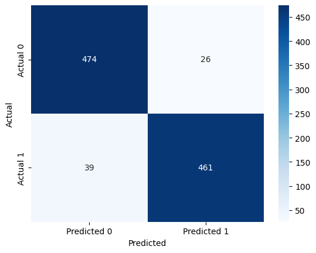

# Sentiment Analysis of Product, Movie, and Restaurants Reviews

The datasets used for this work were created for the Paper 'From Group to Individual Labels using Deep Features', Kotzias et. al,. KDD 2015.

Please cite the paper if you want to use it :)

It contains sentences labeled with positive or negative sentiment, extracted from reviews of products, movies, and restaurants

# Models 
This project implements sentiment analysis using a Hugging Face Transformer model, with PyTorch as the underlying deep learning framework. It compares it to a custom-trained deep learning model (LSTM model with attention). Tokenization and sentence padding are done explicitly for the LSTM model and are done via automatically for the HUggingFace Model.

# Results
Results with the HuggingFace Model are shown below for movie reviews:

# Data Format
sentence \t score \n

# Details:
Score is either 1 (for positive) or 0 (for negative)	
The sentences come from three different websites/fields:

imdb.com

amazon.com

yelp.com

For each website, there exist 500 positive and 500 negative sentences. Those were selected randomly for larger datasets of reviews. 
We attempted to select sentences that have a clearly positive or negative connotation, the goal was for no neutral sentences to be selected.

For the full datasets look:

imdb: Maas et. al., 2011 'Learning word vectors for sentiment analysis'
amazon: McAuley et. al., 2013 'Hidden factors and hidden topics: Understanding rating dimensions with review text'
yelp: Yelp dataset challenge http://www.yelp.com/dataset_challenge
 
